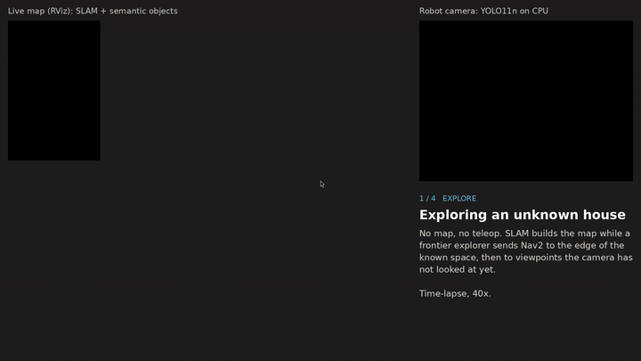
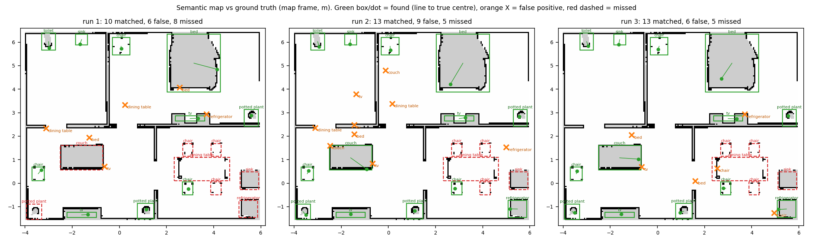
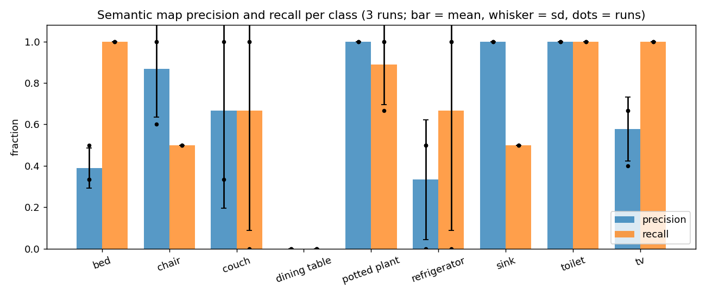
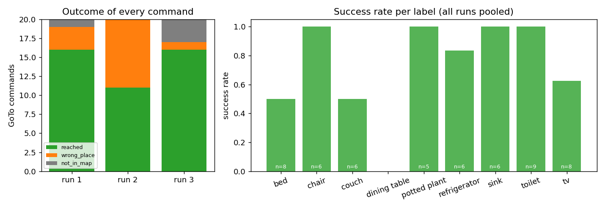
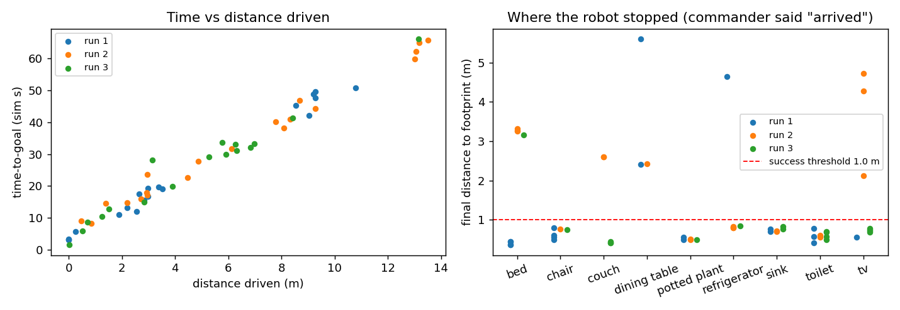
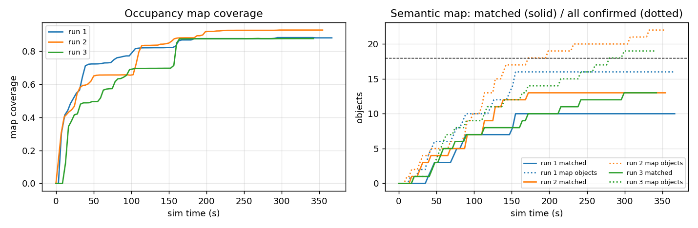
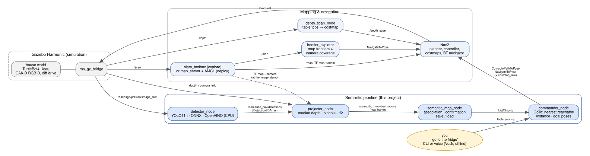

# Semantic Object-Finding Robot

**A TurtleBot 4 that explores an unknown house on its own, learns where the objects are with a CPU-only YOLO detector, and drives to them when you say "go to the fridge".**

[](https://github.com/MHVVD/Semantic-object-finding-robot/actions/workflows/ci.yml)

ROS 2 Jazzy · Gazebo Harmonic · Nav2 · slam_toolbox · YOLO11n → ONNX → OpenVINO · Python (rclpy) · Docker · GitHub Actions

<p align="center">
  
  <br><em>Autonomous exploration → semantic map → "go to the toilet" (time-lapse). Full video: <a href="docs/media/demo.mp4">docs/media/demo.mp4</a> (71 s)</em>
</p>

## What it does

1. **Explores** an unknown house with no teleop: slam_toolbox builds the map, while a
   frontier explorer drives Nav2 first to unknown space, then to viewpoints the camera
   has not looked at yet.
2. **Detects** objects in the RGB-D camera stream (YOLO11n, ONNX on OpenVINO, CPU only, about 30 ms
   per frame on a 2018 laptop i5).
3. **Projects** every detection into the map: median depth inside the box, then the
   pinhole model, then a tf2 transform at the image timestamp.
4. **Fuses** the observations into a persistent **semantic map**: data association,
   confirmation after 10 sightings, and save / load.
5. **Navigates on command**: `go_to fridge` (or say it; offline speech recognition).
   It picks the nearest *reachable* instance by planned path length, generates a safe
   standoff pose facing the object, and drives there with Nav2.
6. **Measures itself** against ground truth over repeated runs, with honest failure analysis.

## Results

Three independent end-to-end runs. Each run explores the unknown house, then executes 20 random GoTo
commands. Everything is scored against the world's ground truth (object list and Gazebo's true
robot pose), never against the robot's own estimates. Values are mean ± sd over the 3 runs.

| Metric | Result |
|---|---|
| Semantic map **precision** | **0.63 ± 0.05** |
| Semantic map **recall** | **0.67 ± 0.10** (12 of 18 objects) |
| Position error of found objects | median **0.19 m**, mean 0.27 m |
| **GoTo success** (robot ends ≤ 1 m from a real object of the requested class) | **72 ± 14 %** (43 / 60) |
| Navigation failures (Nav2 aborts, timeouts) | **0 / 60** |
| Time-to-goal | 31.6 ± 11.6 s sim (≈ 5.6 s per metre) |
| Autonomous exploration | 354 ± 12 s sim, 89 % of the house mapped |
| Detector latency (i5-8265U, 640×480) | 27–37 ms idle, 50–70 ms with the simulation running |

Per class (precision / recall, mean over the 3 runs):

| class | precision | recall | | class | precision | recall |
|---|---|---|---|---|---|---|
| potted plant | 1.00 | 0.89 | | tv | 0.58 | 1.00 |
| toilet | 1.00 | 1.00 | | couch | 0.67 | 0.67 |
| sink | 1.00 | 0.50 | | refrigerator | 0.33 | 0.67 |
| chair | 0.87 | 0.50 | | bed | 0.39 | 1.00 |
| | | | | dining table | 0.00 | 0.00 |

**Every one of the 17 failed GoTo commands was a perception failure.** 13 drove to a false
positive in the semantic map, and 4 asked for an object the map did not contain. The robot
*reported* success 93 % of the time; scoring against ground truth shows the real 72 %.
The full tables, every false positive and every missed object are in
[results/RESULTS.md](results/RESULTS.md).



| | |
|---|---|
|  |  |
|  |  |

## Quickstart (Docker, one command)

Needs Docker with Compose. Works on Linux; RViz needs an X server.

```bash
git clone https://github.com/MHVVD/Semantic-object-finding-robot.git semantic_nav && cd semantic_nav
docker compose up --build demo
```

The first build downloads ROS 2, Gazebo and Nav2, and exports YOLO11n to ONNX: about 15–25
min and ~7 GB. The container then:
1. explores the unknown house and builds the semantic map;
2. prints its precision and recall against ground truth;
3. sends the robot to a toilet, a potted plant and a TV by name.

Results land in `./demo_output/`.

```bash
xhost +local:docker && RVIZ=true docker compose up demo          # watch it in RViz
DEMO_OBJECTS="refrigerator,couch" docker compose up demo         # pick the objects
docker compose up --build test                                   # the unit + lint tests (CI)
```

The camera is rendered in software by default, which works on any machine. On an Intel or AMD
GPU, add `-f docker-compose.yml -f docker-compose.gpu.yml` for faster rendering (see that file).

### Native install (Ubuntu 24.04 + ROS 2 Jazzy)

```bash
mkdir -p ~/semantic_ws && cd ~/semantic_ws
git clone https://github.com/MHVVD/Semantic-object-finding-robot.git .
rosdep install --from-paths src --ignore-src -y
pip install --user --break-system-packages openvino "numpy<2"     # no rosdep key for OpenVINO
python3 -m venv .venv-export
.venv-export/bin/pip install torch torchvision --index-url https://download.pytorch.org/whl/cpu
.venv-export/bin/pip install ultralytics onnx onnxslim
.venv-export/bin/python tools/export_yolo.py yolo11n.pt            # -> src/semantic_nav_perception/models/
colcon build --symlink-install && source install/setup.bash

ros2 launch semantic_nav_bringup exploration.launch.py   # unknown house: explore, map, semantic map
ros2 launch semantic_nav_bringup semantic_nav.launch.py  # known house: AMCL + perception + commander
ros2 run semantic_nav_commander go_to fridge             # (needs commander.launch.py after exploration)
```

Every command, per subsystem, including voice control: [docs/USAGE.md](docs/USAGE.md).

## Architecture



| Node | Subscribes / uses | Publishes / serves |
|---|---|---|
| `detector_node` | `/oakd/rgb/preview/image_raw` | `/semantic_nav/detections` (`vision_msgs/Detection2DArray`), `/semantic_nav/detections_image` |
| `projector_node` | detections + `/oakd/rgb/preview/depth` + `camera_info` (time-synchronised), TF | `/semantic_nav/observations` (`SemanticObjectArray`, map frame), markers |
| `semantic_map_node` | observations | `/semantic_nav/semantic_map` (latched), markers; services `list_objects`, `save_map`, `load_map` |
| `commander_node` | `ListObjects`, `/global_costmap/costmap_raw`, TF | service `/semantic_nav/go_to` (`GoTo`), `/semantic_nav/cancel`; actions `ComputePathToPose`, `NavigateToPose` |
| `voice_command` | microphone (Vosk, offline, restricted grammar) | calls `go_to` / `cancel`; `/semantic_nav/voice/heard` |
| `frontier_explorer` | `/map`, TF | `NavigateToPose` goals; `/semantic_nav/exploration/status` |
| `depth_scan_node` | `/oakd/rgb/preview/depth` + `camera_info`, TF | `/depth_scan` (`LaserScan` of obstacles 0.05–1 m high) for a separate layer in Nav2's local costmap |

**TF tree.** `map → odom` comes from slam_toolbox or AMCL. `odom → base_link` comes from the wheel odometry.
`base_link → … → oakd_rgb_camera_optical_frame` comes from the URDF (fixed).

```
map ──(slam_toolbox | AMCL)──> odom ──(diff-drive odometry)──> base_link ─┬─> rplidar_link
                                                                          └─> oakd_link → oakd_rgb_camera_frame
                                                                                → oakd_rgb_camera_optical_frame
                                                                                  (z forward, x right, y down)
```

Detections are deprojected in the optical frame, then transformed to `map` with the transform
**at the image timestamp**, not the latest one. That matters when the robot is turning.

## Features

- **CPU-only perception.** YOLO11n exported to ONNX (dynamic shape, reshaped to 640×480) and
  compiled by OpenVINO with a latency hint. The letterbox matches Ultralytics' preprocessing
  exactly, and class-aware NMS runs in numpy. Rate-limited to 5 Hz to keep the simulation
  real-time factor up.
- **Robust 3D projection.** Median depth in the central half of each box (robust to the
  background at the box edges). Handles 32FC1 and 16UC1 depth. tf2 failures are counted and
  dropped, never guessed.
- **Semantic map.**
  - Per-frame one-to-one association: greedy, or Hungarian (same results on our data).
  - Per-class gates: beds and sofas are 2 m long.
  - A running mean, and confirmation after N sightings with a timeout for tentative tracks.
  - Atomic YAML save and load.
- **Depth camera in the costmap.** A height-filtered scan from the depth image (table tops,
  chair seats) feeds its own layer in the local costmap, so the lidar cannot clear it.
- **Goal generation on the costmap.** Candidate poses on circles around the object. It rejects
  lethal, inscribed and unknown cells, and points that are only reachable "through the wall".
  The robot faces the object, and the nearest instance is chosen by *planned path length*.
- **Async ROS 2 done right.** Coroutine service callbacks, a `MultiThreadedExecutor`
  and a reentrant callback group, so feedback, cancel and a new goal are served
  while a `GoTo` waits for Nav2.
- **Autonomous exploration.**
  - Phase 1: frontiers scored by geodesic distance against frontier size.
  - Phase 2: camera coverage. The lidar finishes the map long before the camera has *seen*
    the furniture.
  - Termination is guaranteed: blacklists, plus progress and time limits.
- **Offline voice control.** Vosk with a grammar built from the known object names. It understands
  "go to the fridge", "take me to the sofa" and "stop", and no audio leaves the machine.
- **Evaluation tooling.**
  - Detector AP per class.
  - Projection error split into range and lateral components.
  - Semantic map precision and recall.
  - A GoTo benchmark scored with the true pose.
  - Repeated-run statistics and auto-generated plots.
- **Engineering.**
  - Parameters live in YAML; nodes have no hard-coded defaults.
  - 301 tests: unit tests for all the maths (deprojection, association, goal generation,
    frontiers, scoring) plus flake8, pep257 and copyright lint.
  - CI on GitHub Actions, and a reproducible Docker image.
  - A problems log with 97 entries.

## Design decisions

| Decision | Why | Trade-off |
|---|---|---|
| YOLO11n + OpenVINO on CPU | Runs on a laptop with a weak GPU; 27 ms vs 33 ms for YOLOv8n, and better mAP on our frames | COCO-trained: misses objects seen from 24 cm high (see Limitations) |
| Detector → projector → map as separate nodes | Each stage is testable and replaceable, and observable in RViz | Extra serialisation, negligible at 5 Hz |
| Median depth in a shrunk box | Box edges are mostly background; the median ignores them | Measures the near *surface*, not the centre (≈ 1 m off for a 2 m bed) |
| TF at the image stamp, drop on failure | A turning robot otherwise smears objects (measured: up to 7° AMCL yaw lag) | Startup frames are dropped |
| Nearest neighbour + confirmation N = 10 | Simple and explainable; N = 3 → 10 cut false positives from 16 to 4–6 with no object lost | Consistent detector mistakes still get confirmed |
| Nearest instance by *planned path*, not straight line | An object behind a wall can be far to drive | One planner call per instance |
| Our own frontier explorer (explore_lite optional) | explore_lite builds on Jazzy but live-locked in 1 of 2 runs, and knows nothing of the camera | More code to own |
| Ground-truth scoring with the simulator's pose | The robot cannot grade itself: it claimed 93 %, the truth is 72 % | Simulation-only; a real robot needs a measured reference |
| Python (rclpy) everywhere | Speed of iteration; the heavy lifting is in OpenVINO, numpy and Nav2 | Not for 100 Hz control loops (not needed here) |

## Limitations

- **Perception is the bottleneck.** The dining table, the kitchen sink and the chairs behind the
  table are *never* detected. The camera is 24 cm above the floor, and COCO was photographed at
  eye level. The robot does see them.
- **Consistent false positives are confirmed.** For example, the bedroom TV is taken for a
  "refrigerator" in 2 of 3 runs. Counting sightings cannot reject a mistake that repeats from
  every viewpoint, and the commander then drives confidently to the wrong place.
- **The evidence filter is fragile.** "Ignore instances seen < 25 % as often as the best one"
  once discarded the *real* couch because a phantom had more sightings.
- **Mostly 2D.** The lidar sees table legs, not tabletops, so the robot can get stuck under a table.
  Since M9 a `depth_scan_node` puts what the camera sees (0.05–1 m high) into its own layer of
  the *local* costmap, so the robot stops at a table it is looking at. The global planner still
  cannot see table tops. A 3D voxel layer would be the full fix.
- **Simulation only.** It uses one house, perfect depth and known textures; the numbers will be
  worse on a real robot.
- **Three runs.** The 95 % interval on the mean GoTo success is about ±36 points. That is enough
  to see what is systematic, not to resolve small differences.

## Future work

Ordered by measured impact on GoTo success:

1. **Verify on arrival.** Look with the detector at the goal; if the object is not there, mark it
   refuted and try the next instance. The upper bound from our data is 72 % → 87 %, with no new model.
2. **Negative evidence in the semantic map.** Objects that should be visible but are not detected
   lose belief. This removes the consistent phantoms behind 13 of the 17 failures.
3. **Fine-tune the detector on robot-height views.** The capture tool and the Colab notebook
   already exist (`tools/finetune_yolo_colab.ipynb`). Alternatively, mount the camera higher.
4. **Full 3D costmap** (voxel layer from the depth camera). The M9 `depth_scan_node` is the
   cheap 2D version of this.
5. **A real TurtleBot 4.** Discovery server and QoS tuning, camera calibration, a measured
   ground truth, and the same benchmark.
6. **Open-vocabulary detection** (e.g. YOLO-World or CLIP features) and a 3D scene graph:
   "the chair next to the bed".

## Repository layout

```
src/semantic_nav_interfaces   SemanticObject(Array).msg, GoTo / ListObjects / MapFile.srv
src/semantic_nav_perception   detector_node, projector_node, YOLO pre/post-processing, evaluation
src/semantic_nav_mapping      semantic_map_node, association (greedy / Hungarian)
src/semantic_nav_commander    commander_node, goal generation, go_to CLI, voice_command
src/semantic_nav_bringup      launch, worlds (house.sdf), URDF, Nav2 / SLAM / node params,
                              frontier explorer, evaluation and benchmark scripts
tools/                        model export, Colab fine-tuning, benchmarks, results, demo, local CI
results/                      raw benchmark data, tables (RESULTS.md) and plots
docs/                         architecture diagram, usage by milestone, problems log, demo shot list
```

## Development

```bash
colcon test && colcon test-result --verbose     # 301 tests
tools/ci_local.sh                               # the CI job, in the same container, on a clean tree
tools/run_benchmarks.sh 1 3 && python3 tools/make_results.py   # reproduce the results (~2 h)
```

Problems encountered and how they were solved: [docs/PROBLEMS_LOG.md](docs/PROBLEMS_LOG.md).
The project was built in milestones, each ending with a written report:

- [x] M0 — workspace, interfaces, CI
- [x] M1 — simulation: house world, TurtleBot4, bridge, RViz
- [x] M2 — SLAM map + Nav2/AMCL navigation
- [x] M3 — detection: YOLO11n → ONNX → OpenVINO, evaluated per class
- [x] M4 — projection: depth + intrinsics + TF → map-frame observations
- [x] M5 — semantic map: association, confirmation, services, save/load
- [x] M6 — commander: GoTo service, goal generation, Nav2, CLI and voice
- [x] M7 — autonomous exploration: frontiers + camera coverage, no teleop
- [x] M8 — evaluation: precision/recall, GoTo benchmark, 3 runs, failure analysis
- [x] M9 — portfolio polish: README, Docker quickstart, demo, cleanup

## License

Apache-2.0 ([LICENSE](LICENSE)). The YOLO11n weights are Ultralytics' (AGPL-3.0). They are not
included; they are downloaded and exported at build time. Furniture models come from Gazebo
Fuel under their own licenses.
